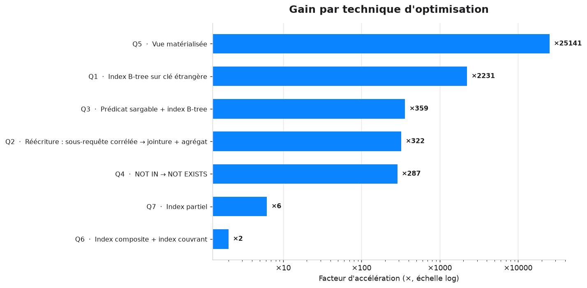
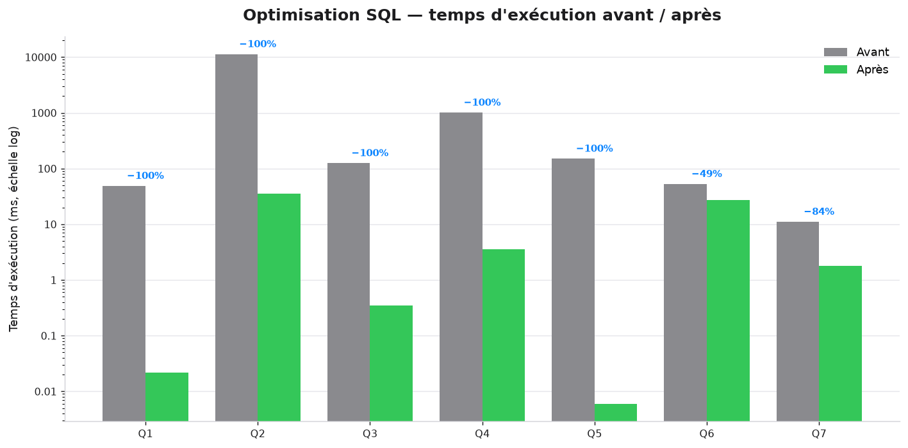

# Optimisation de requêtes SQL — PostgreSQL, de bout en bout

> Projet portfolio **data engineering** — démontre l'optimisation de requêtes
> analytiques sur une base e-commerce volumineuse (~1,35 M de lignes), avec des
> mesures **avant / après reproductibles et chiffrées**.

Pour chaque requête lente : mesure de la baseline, lecture du plan
(`EXPLAIN ANALYZE`), optimisation appliquée (index, réécriture, vue
matérialisée, partitionnement) puis mesure du gain. **Gains mesurés : de ×2 à
×25 000.**

<p align="center">
  
</p>

---

## 1. Contexte & objectif

Les requêtes analytiques sur de gros volumes sont un point de douleur classique.
L'objectif de ce projet est de **montrer une démarche d'optimisation rigoureuse**,
pas seulement un résultat : partir de requêtes naïves volontairement lentes,
**diagnostiquer** via le planificateur, appliquer la **bonne** technique, et
**quantifier** le gain de façon reproductible.

| | |
|---|---|
| **SGBD** | PostgreSQL 17 |
| **Jeu de données** | e-commerce, ~1,35 M de lignes (généré, seed fixe) |
| **Outillage** | Python 3.12 · psycopg 3 · matplotlib · Streamlit |
| **Mesure** | `EXPLAIN (ANALYZE, BUFFERS, FORMAT JSON)`, médiane sur N exécutions |

## 2. Le jeu de données

Schéma e-commerce classique, généré entièrement côté serveur avec
`generate_series` + `random()` et une **graine fixe** (`setseed`) → données
strictement identiques d'une exécution à l'autre.

```
clients (100 000) ──< commandes (250 000) ──< lignes_commande (~1 000 000) >── produits (5 000)
```

| Table | Lignes | Taille |
|---|---:|---:|
| `clients` | 100 000 | 12 Mo |
| `produits` | 5 000 | 0,6 Mo |
| `commandes` | 250 000 | 20 Mo |
| `lignes_commande` | ~1 000 000 | 79 Mo |

Point de départ volontaire : **seules les clés primaires sont indexées**.
PostgreSQL n'indexe jamais automatiquement les colonnes de clés étrangères —
c'est précisément ce qui rend la baseline lente (parcours séquentiels, jointures
par hachage coûteuses, sous-requêtes corrélées en boucle).

## 3. Méthodologie de mesure

- Temps relevé **côté serveur** via `EXPLAIN (ANALYZE, FORMAT JSON)` → champ
  `Execution Time` (exclut la latence réseau et le transfert des résultats).
- **1 exécution de chauffe** (cache) puis **médiane de 5 exécutions** (robuste
  aux pics).
- **Isolation** : avant chaque cas, tous les index/vues d'optimisation sont
  supprimés → on mesure une technique à la fois, sans interférence.
- **Honnêteté des chiffres** : la base (~110 Mo) tient en RAM et le parallélisme
  est activé. Les temps absolus sont donc petits ; ce sont les **gains relatifs**
  qui reflètent l'amélioration algorithmique (parcours séquentiel → index,
  O(n²) → O(n), recalcul → pré-agrégation). Les valeurs < 0,1 ms sont au plancher
  de résolution de la mesure.

## 4. Résultats

<p align="center">
  
</p>

| # | Requête | Technique | Avant | Après | Gain | Accél. |
|---|---|---|---:|---:|---:|---:|
| Q1 | Détail d'un client | Index B-tree (clé étrangère) | 49,1 ms | 0,02 ms | −100 % | ×2 231 |
| Q2 | Nb commandes / client VIP | Réécriture corrélée → jointure | 11 340 ms | 35,2 ms | −99,7 % | ×322 |
| Q3 | Commandes d'un mois | Prédicat sargable + index | 125,4 ms | 0,35 ms | −99,7 % | ×359 |
| Q4 | Produits jamais commandés | `NOT IN` → `NOT EXISTS` | 1 012 ms | 3,5 ms | −99,7 % | ×287 |
| Q5 | Top 10 produits par CA | Vue matérialisée | 150,8 ms | 0,006 ms | −100 % | ×25 141 |
| Q6 | CA mensuel d'une catégorie | Index composite + couvrant | 53,0 ms | 27,1 ms | −48,8 % | ×2,0 |
| Q7 | Commandes annulées / mois | Index partiel | 11,1 ms | 1,8 ms | −83,8 % | ×6,2 |

> Chiffres issus de `results/benchmarks.json` (PostgreSQL 17, médiane de 5 runs).
> Les plans `EXPLAIN ANALYZE` complets sont archivés dans `results/plans/`.

## 5. Détail par requête

### Q1 — Clé étrangère non indexée → index B-tree
**Problème.** On veut les commandes d'un client et leur montant. `client_id`
n'est pas indexé : PostgreSQL parcourt **toute** la table `commandes`.

**Diagnostic (avant).** `Parallel Seq Scan on commandes` (250 k lignes lues pour
2 utiles) puis `Parallel Hash Join`.

**Optimisation.** Index B-tree sur `commandes(client_id)` **et**
`lignes_commande(commande_id)`.

**Après.** Le plan devient `Bitmap Index Scan → Nested Loop → Index Scan`,
**13 buffers** lus au lieu de centaines de milliers :
```
Nested Loop (actual time=0.005..0.007 rows=7)
  ->  Bitmap Heap Scan on commandes  (Recheck Cond: client_id = 12345)
        ->  Bitmap Index Scan on idx_commandes_client_id
  ->  Index Scan using idx_lignes_commande_id on lignes_commande
Execution Time: 0.022 ms
```
**49 ms → 0,02 ms (×2 231).**

### Q2 — Sous-requête corrélée → jointure + agrégat
**Problème.** Pour chaque client VIP parisien, une sous-requête scalaire recompte
les commandes : elle est **ré-exécutée une fois par client**.

**Diagnostic (avant).** Le plan montre un `SubPlan` avec `loops=1754`, chaque
itération parcourant toute la table `commandes` (`Rows Removed by Filter:
249997`), soit **3,26 M de buffers** lus, 11,3 s.

**Optimisation.** Réécriture en `LEFT JOIN ... GROUP BY` : `commandes` n'est lue
**qu'une seule fois** (`Parallel Hash Right Join`, 3 251 buffers).
> Détail instructif : ici l'index sur `client_id` **n'est pas** retenu par le
> planificateur — l'agrégat a besoin de toutes les commandes, le parcours
> séquentiel parallèle est optimal. **C'est la réécriture seule qui gagne.**

**11 340 ms → 35 ms (×322).**

### Q3 — Prédicat non-sargable → sargable + index
**Problème.** `EXTRACT(YEAR/MONTH FROM date_commande) = ...` applique une fonction
à chaque ligne : **aucun index utilisable**.

**Optimisation.** Réécriture en intervalle sur la colonne brute
`date_commande >= '2024-06-01' AND < '2024-07-01'` (sargable) + index B-tree.
→ `Index Scan` sur un sous-ensemble sélectif.

**125 ms → 0,35 ms (×359).**

### Q4 — `NOT IN` → `NOT EXISTS`
**Problème.** `NOT IN (sous-requête sur ~1 M lignes)` empêche une anti-jointure
efficace (et la sémantique des `NULL` est piégeuse). Coût estimé à 71 M.

**Optimisation.** `NOT EXISTS` → vraie **anti-jointure** (`Hash Anti Join`), plus
un index sur `produit_id`.

**1 012 ms → 3,5 ms (×287).**

### Q5 — Agrégation lourde → vue matérialisée
**Problème.** Le classement recalcule le CA en agrégeant ~1 M de lignes à
**chaque appel**.

**Optimisation.** Vue matérialisée `mv_ca_produit` (CA pré-calculé par produit) +
index sur `ca DESC`. La requête se réduit à lire 10 lignes.
> Compromis assumé : une vue matérialisée doit être **rafraîchie**
> (`REFRESH MATERIALIZED VIEW`) — on échange de la fraîcheur contre de la vitesse,
> pertinent pour un tableau de bord recalculé périodiquement.

**151 ms → 0,006 ms (×25 141).**

### Q6 — Jointure 3 tables → index composite + couvrant
**Problème.** Jointure `produits × commandes × lignes_commande` filtrée sur une
catégorie et un mois ; sans index, parcours complet de `lignes_commande`.

**Optimisation.** Index sur `produits(categorie)` et `commandes(date_commande)`
pour filtrer tôt ; **index couvrant** `lignes_commande(commande_id) INCLUDE
(produit_id, quantite, prix_unitaire, remise)` → jointure et agrégat servis
**sans retour à la table** (heap).
> Leçon sur la **sélectivité** : une première version sur l'année entière ne
> tirait **aucun** profit des index (le parcours séquentiel parallèle restait
> optimal, voire plus rapide). Un index n'aide que si le filtre est sélectif —
> ici, resserrer à un mois rend les index gagnants.

**53 ms → 27 ms (×2,0).**

### Q7 — Sous-ensemble rare → index partiel
**Problème.** ~5 % des commandes sont annulées, mais la requête parcourt les
250 k lignes pour les retrouver.

**Optimisation.** **Index partiel** `... WHERE statut = 'annulee'` : minuscule, il
ne contient que le sous-ensemble interrogé.

**11 ms → 1,8 ms (×6,2).**

### Bonus — Partitionnement (`sql/06_partitionnement.sql`)
Copie de `commandes` partitionnée par **année** sur `date_commande`. Une requête
filtrée sur juin 2024 ne lit **que** la partition `commandes_2024` (les trois
autres années sont élaguées — *partition pruning*) :
```
Seq Scan on commandes_2024  (rows=5993)      ← seule partition touchée
Execution Time: 3.1 ms
```
Atout opérationnel : archiver une année = `DETACH`/`DROP` d'une partition
(quasi instantané) au lieu d'un `DELETE` de masse.

## 6. Reproduire le benchmark

**Prérequis** : PostgreSQL 17 (natif ou Docker) et Python 3.12.

```bash
# 1. Base de données
#    Option A — Docker (rien à installer) :
docker compose -f docker/docker-compose.yml up -d
#    Option B — PostgreSQL natif déjà installé :
createdb ecommerce

# 2. Schéma + données (~10 s)
psql -d ecommerce -f sql/01_schema.sql
psql -d ecommerce -f sql/02_seed.sql

# 3. Environnement Python
python -m venv .venv
source .venv/bin/activate            # Windows : .venv\Scripts\activate
pip install -r requirements.txt
cp .env.example .env                 # adapter les identifiants si besoin

# 4. Benchmark + graphes
python benchmark/bench.py --runs 5   # mesure avant/après → results/benchmarks.json
python benchmark/plots.py            # figures → results/figures/

# 5. (Optionnel) Dashboard interactif
streamlit run dashboard/app.py
```

Exploration manuelle des plans, dans l'ordre :
`sql/03_baseline.sql` (lent) → `sql/04_optimisations.sql` (index/vues) →
`sql/05_optimise.sql` (rapide).

## 7. Enseignements (pièges rencontrés)

Quelques écueils réels traversés pendant la construction — documentés car ils
sont au cœur du métier :

- **`random()` dans une sous-requête non corrélée n'est évalué qu'une fois** pour
  toute la requête → toutes les lignes reçoivent la même valeur (j'ai d'abord eu
  100 % de commandes « livrée » et tous les produits au même prix). La règle :
  mettre les `random()` dans la **liste SELECT** d'une requête qui balaie les
  lignes.
- **`ROLLBACK` n'annule pas l'avancement d'une séquence `IDENTITY`** → d'où un
  `TRUNCATE ... RESTART IDENTITY` pour rendre le seed idempotent.
- **`round(double precision, int)` n'existe pas** en PostgreSQL → cast explicite
  en `numeric`.
- **Sélectivité avant tout** : un index ne sert que si le filtre est sélectif
  (Q6) ; sinon le parcours séquentiel parallèle reste le meilleur choix.
- **Réécrire peut suffire** : la plus grosse accélération de bout en bout (Q2)
  vient d'une réécriture, sans aucun index.

## 8. Structure du dépôt

```
.
├── sql/                    # 01 schéma · 02 seed · 03 baseline · 04 optimisations
│                           # · 05 optimisé · 06 partitionnement
├── benchmark/              # db.py · queries.py · bench.py · plots.py
├── dashboard/              # app.py (Streamlit)
├── results/                # benchmarks.json · plans/ · figures/
├── docker/                 # docker-compose.yml (PostgreSQL 17)
├── requirements.txt · .env.example · .gitignore · LICENSE (MIT)
└── README.md
```

## Licence

[MIT](LICENSE) — Nael Benchalal, 2026.
